# How to make a PR

- [How to make a PR](#how-to-make-a-pr)
  - [网页直接操作](#网页直接操作)
  - [复制到本地操作](#复制到本地操作)
  - [总结](#总结)

我们以一个[卢瑟的仓库](https://github.com/OpenTritium/Snowflakes)为例。

打开的样子就是下面：

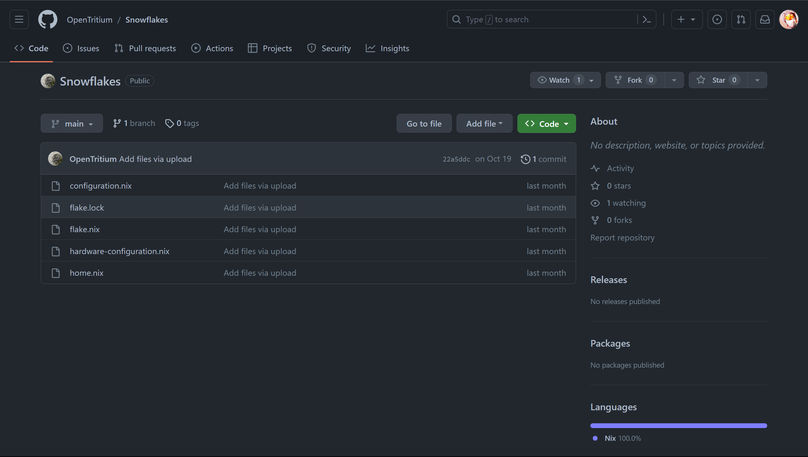

我们需要去 [**fork**](https://github.com/OpenTritium/Snowflakes/fork) 它：

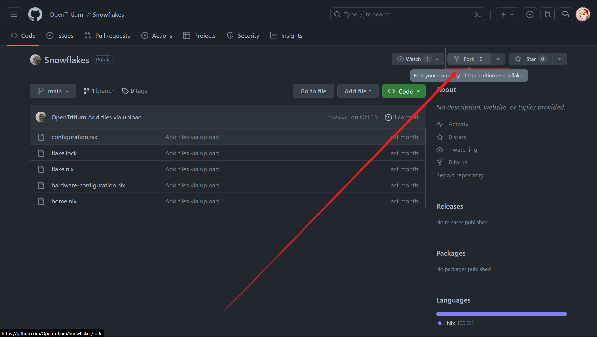

然后会显示：

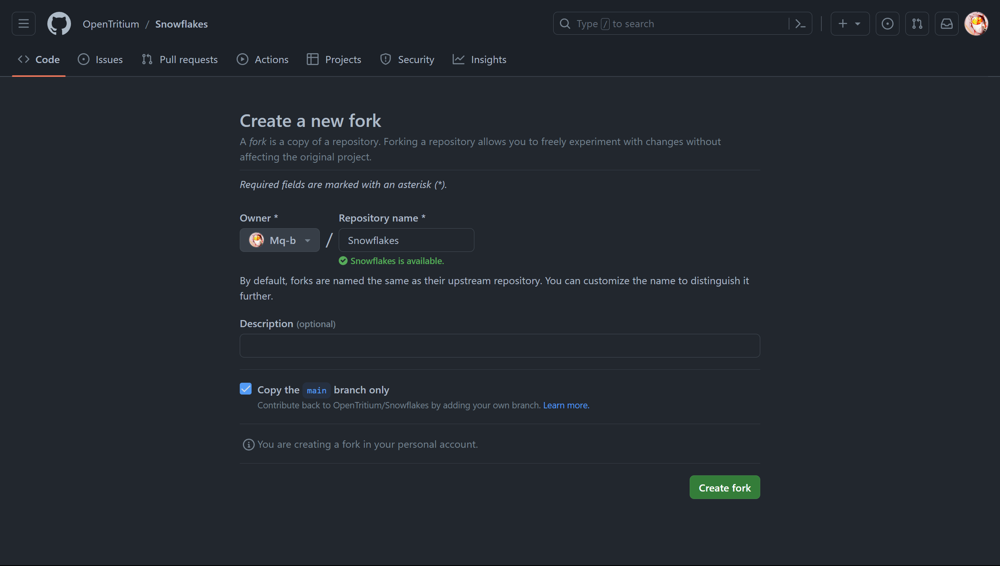

Repository name（仓库名） 必须写，用默认也行， Description（说明） 可写可不写，我们修改好之后直接点击绿色按钮，**Create fork** 就可以了。

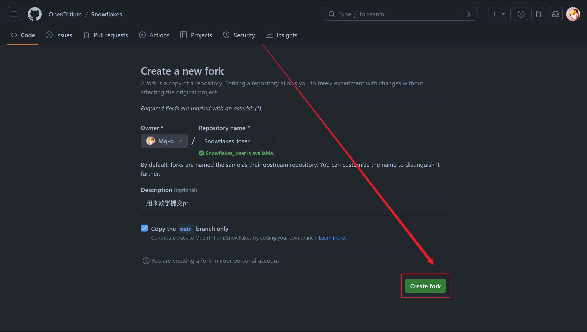

这样我们就会拥有一个这个仓库的副本，默认会跳转到仓库中。

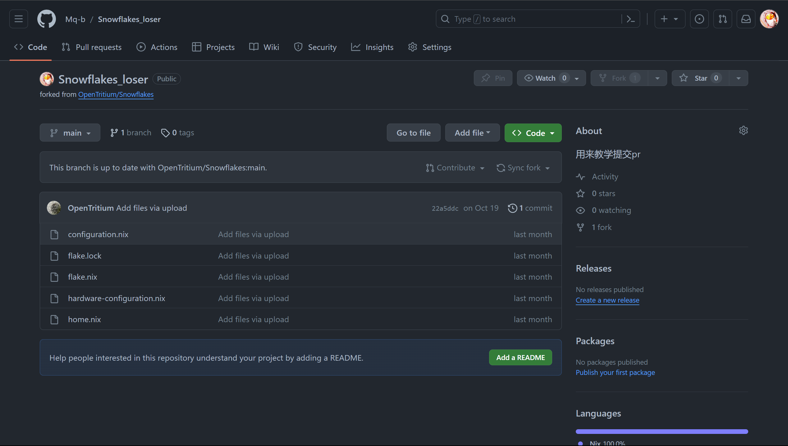

到此我们可以选择几种方式进行修改：

- 直接在网页上修改提交，然后提出 pr。
- 复制到本地，再进行修改提交，然后再提出 pr。

## 网页直接操作

我们先讲网页上的简单操作（通常不推荐，而且下面示例没新建分支）：

新建一个文件，然后修改，点击绿色按钮提交更改：

设置提交信息，点击提交：

然后提交 pr，如下：

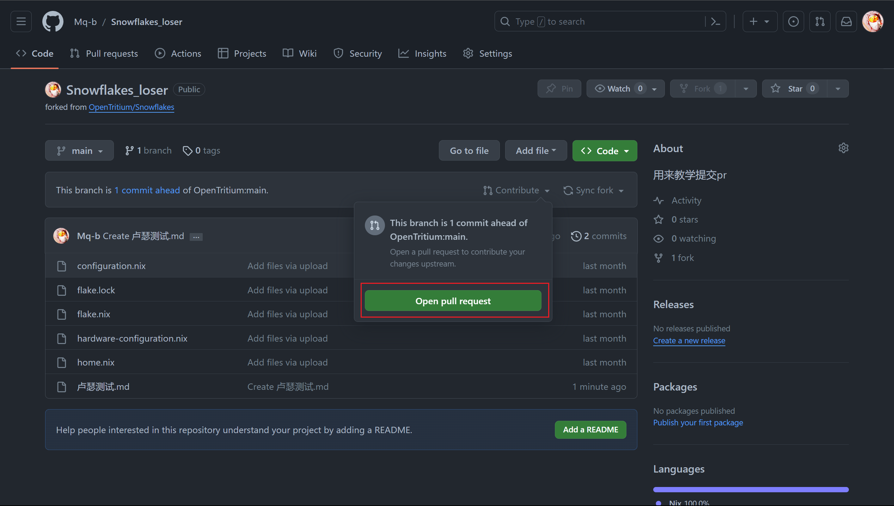

确认：

此时默认就会跳转到原仓库，你可以看到自己的 pr 了，如下：

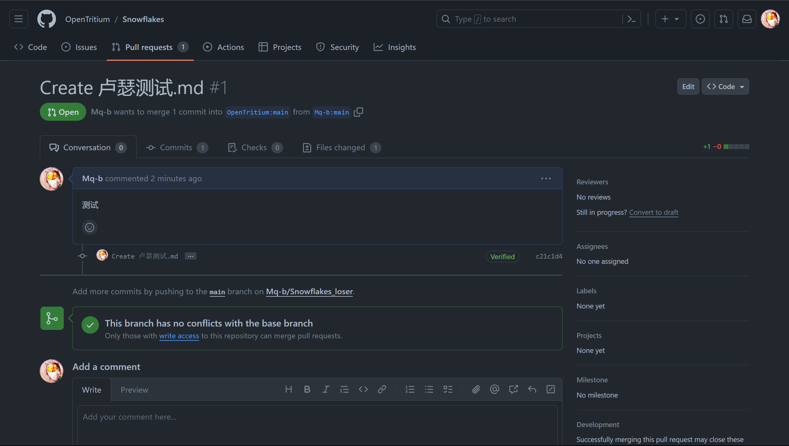

## 复制到本地操作

通常应该如此，我们这里不讲使用命令行的方式，我们以 vscode 为例（其实通常各类 IDE 都差不多）。

我们已经 fork 了仓库，复制它的链接。

我用户名是 Mq-b，我 fork 了这个仓库的链接是:https://github.com/Mq-b/Snowflakes_loser （你们不能用）

其实直接去自己的的仓库列表找到这个仓库然后点进去复制链接就好。

打开 vscode：

打开 git 选项，点击克隆仓库：

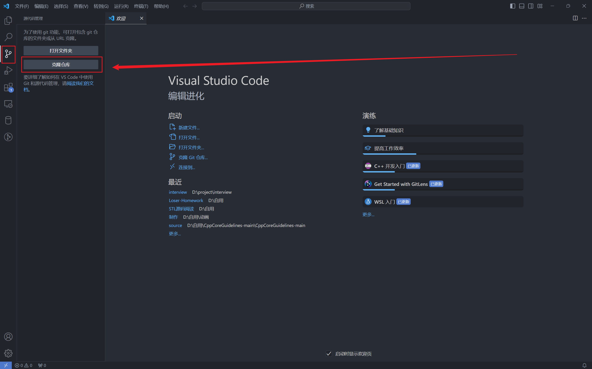

输入我们先前复制的自己仓库的链接：

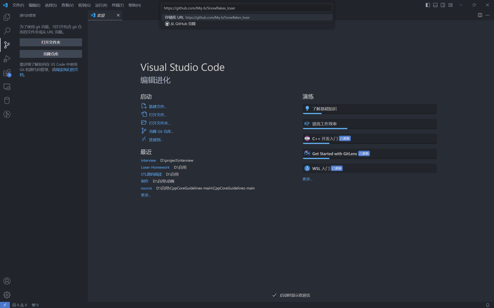

选择本地存储位置，我们自己创建一个空的文件夹就好

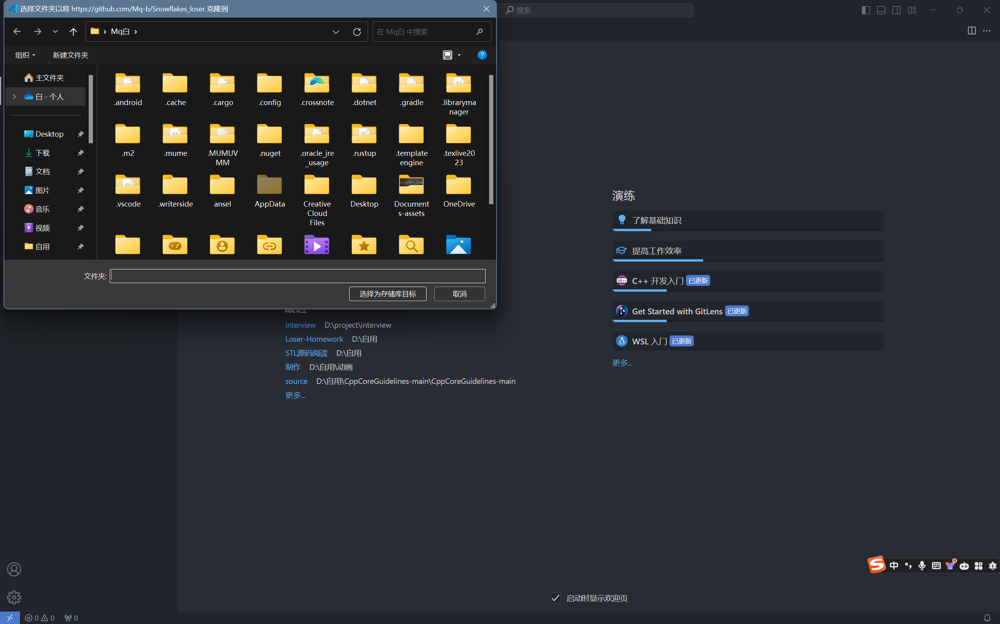

等待克隆完毕，会提示我们：

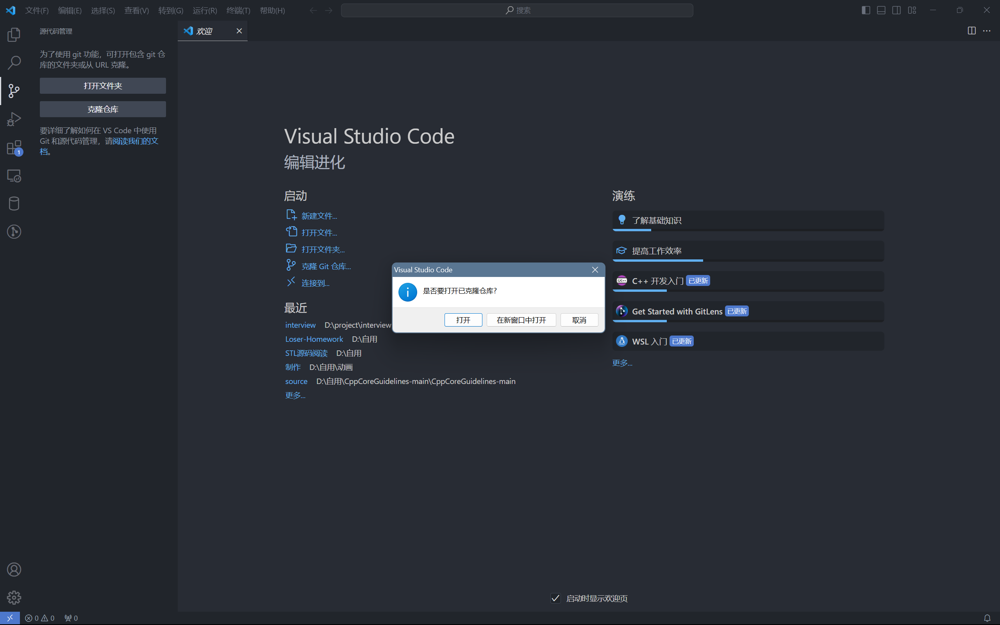

直接打开，然后新建分支：

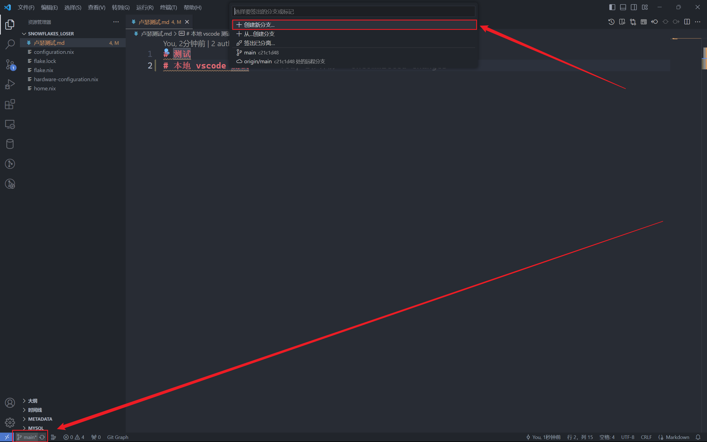

设置分支的名字：

然后我们进行修改，注意一定要是在我们新建的分支里面进行修改：

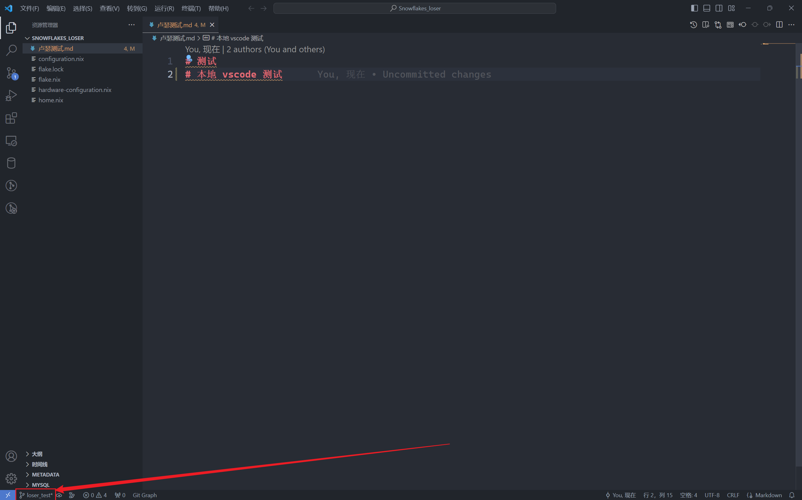

然后直接进行提交和推送，如果有问什么的，同意就好。

回到我们自己的 github 仓库中会看到：

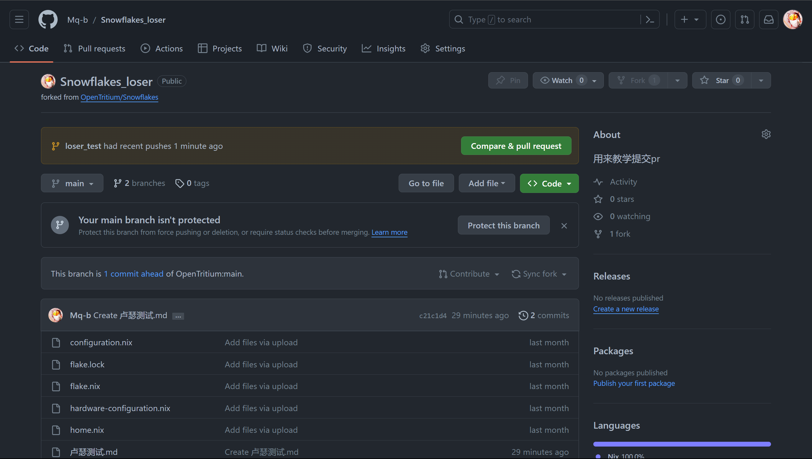

点击绿色按钮，你会看到一些关于这个 pr 的设置，标题，和说明；根据自己的需求写就好。

点击绿色按钮，创建这个 pr，然后跳转如下：

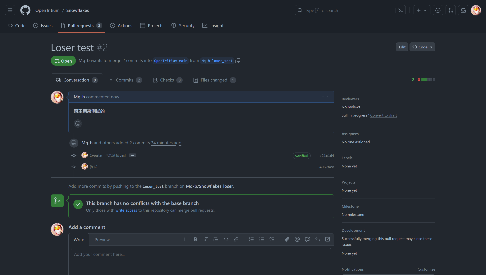

如果你还还要修改这个 pr 提交的东西，也很简单，vscode 打开本地的那个项目，修改就是（记住是修改你提交 pr 的那个分支），修改完毕直接提交，pr 也会同步修改的，并且会显示你这个 pr 有两个提交。

这个 pr 就创建完毕了。

## 总结

你不要和我聊你没 github 账号，没下载 vscode，自己整。

还有令牌之类的事情，自己整。

需要注意的是**网页版的示例我们没新建分支，这很不好**。

值得一提的是，github 使用 utf8 编码，如果你发现你上传的东西乱码，很正常，国内的 windows 电脑默认使用国标 GB2312 或 GB18030，自行处理。
